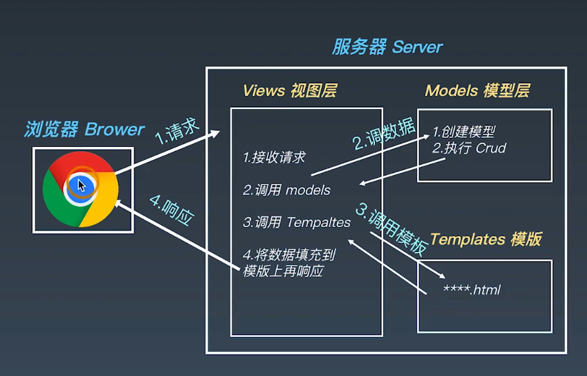

# 学习笔记

## 开发环境配置

Django 最初被设计用于具有快速开发需求的新闻类站点，目的是要实现简单快捷的网站开发。

### MVC 设计模式 

>  设计模式: 前人根据开发经验，沉淀下来的一套编程的指导思想

### MTV 框架模式

* 模型（Model）
* 模版（Template）
* 视图（Views）



### Django 的特点

* 采用了 MTV 框架
* 强调快速开发和代码复用 DRY（Do not Repeat Yourself）
* 组件丰富

> ORM （对象关系映射）映射类来构建数据模型
>
> URL 支持正则表达式
>
> 模版可继承
>
> 内置用户认证，提供用户认证和权限功能
>
> admin 管理系统
>
> 内置表单模型、Cache 缓存系统、国际化系统等

Django 学习使用 2.2.13 （LTS 版本）

```shell
pip install --upgrade django==2.2.13
```

